# 基础知识

## 变量名编写规范

官方推荐 蛇形 写法

## 常量

## 数据类型

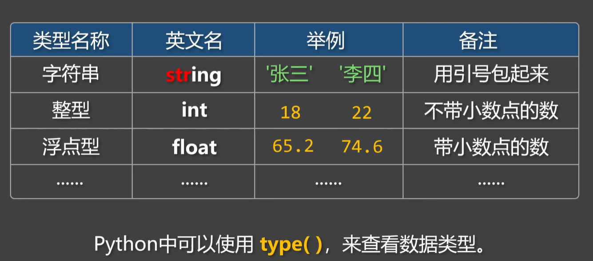

## 整形

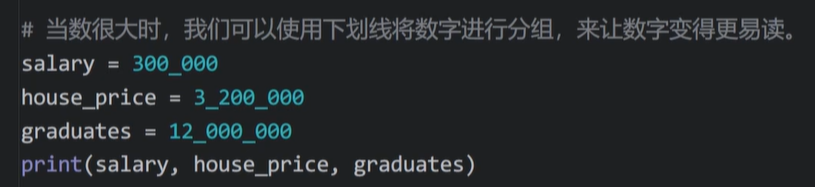

## 浮点型

浮点型的科学计数法表示

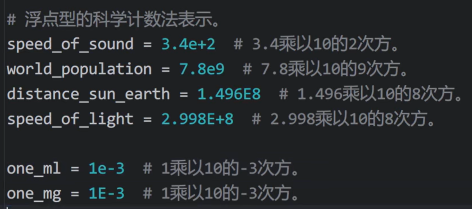

 ## 字符串

### 格式化

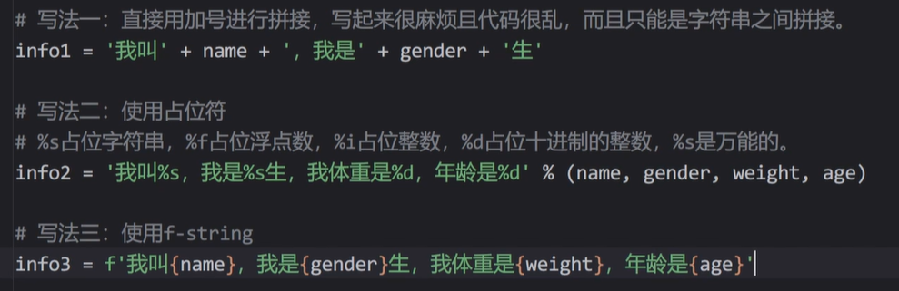

### 转义字符

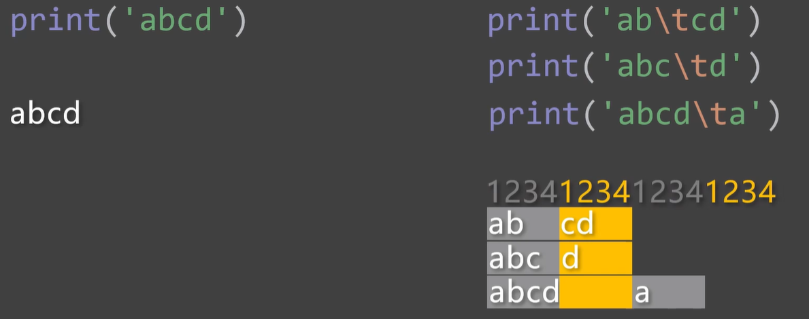

## 数据类型转换

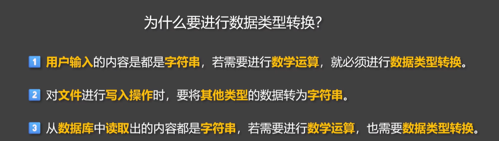

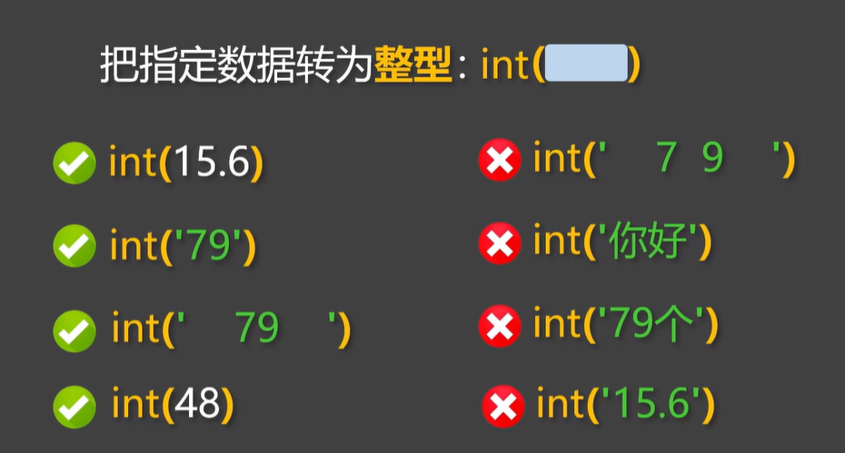

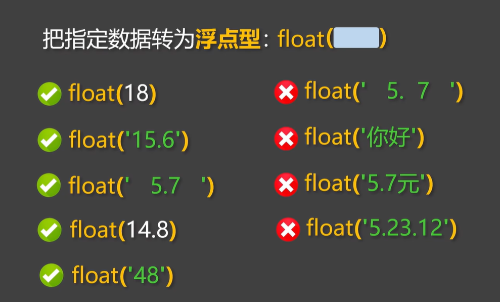

## 算数运算符

整除也会有 .0 比如 4/2 = 2.0

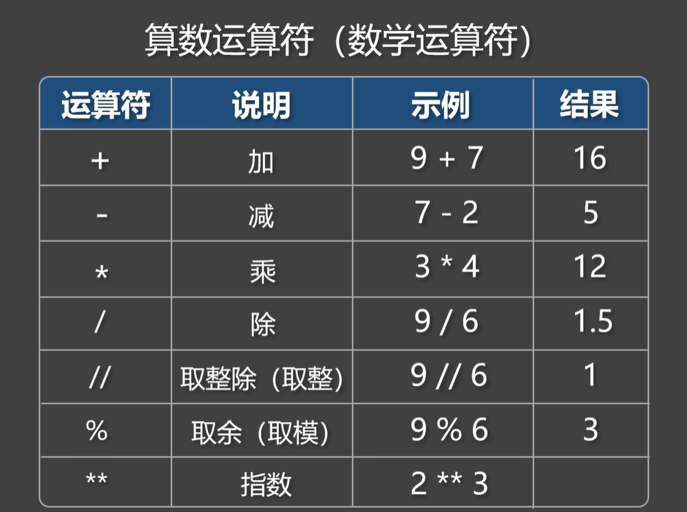

## 复合赋值运算符

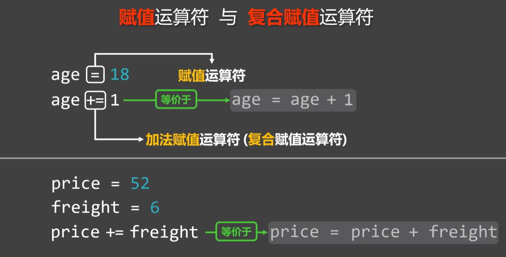

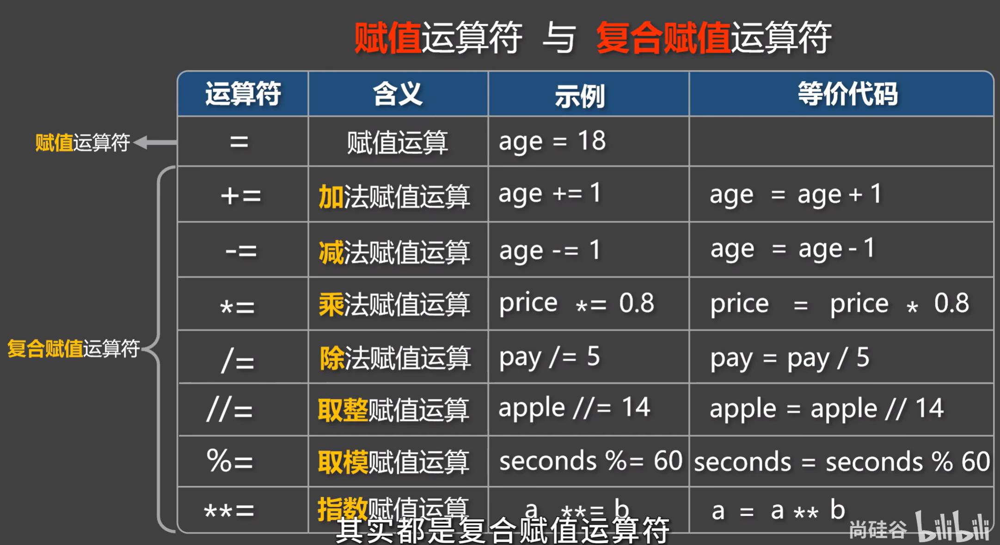

## 比较运算符

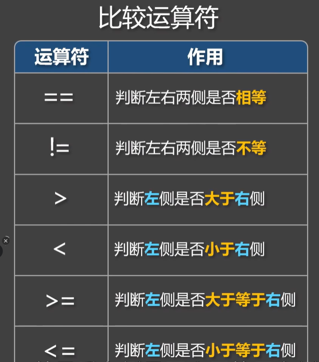

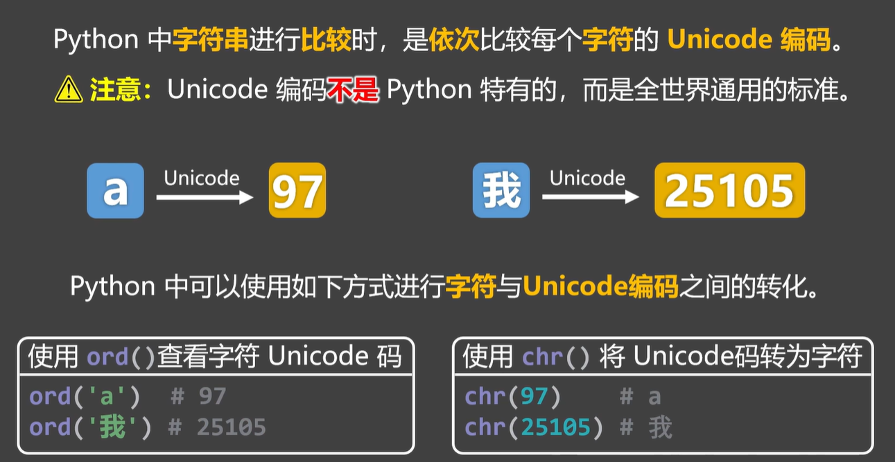

## 布尔类型

数字非 0 都是True

字符串非 空 都是True

## 逻辑运算符

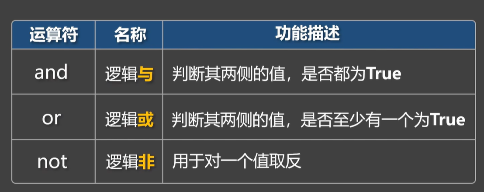